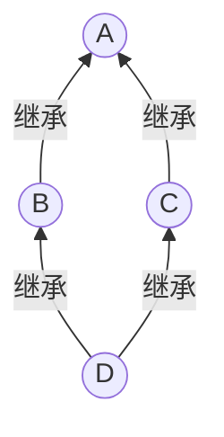

# inheritance 继承

[toc]

## 单继承
#### 继承方式
- `public`继承

|基类|派生类|
|:--:|:--:|
|`public`|`public`|
|`protected`|`protected`|
|`private`|不可直接使用|

- `protected`继承

|基类|派生类|
|:--:|:--:|
|`public`|`protected`|
|`protected`|`protected`|
|`private`|不可直接使用|

- `private`继承

|基类|派生类|
|:--:|:--:|
|`public`|`private`|
|`protected`|`private`|
|`private`|不可直接使用|

#### 继承关系
```cpp
class A;

class B: public A{
    ...
};
```
- 派生类的自定义拷贝构造函数默认调用基类的默认拷贝构造函数，需调用自定义拷贝构造函数要在成员初始化表指明
- 派生类不继承赋值操作
- 可在派生类的成员定义中调整基类成员的访问控制
```cpp
[public: | private: | protected:]
    <基类名>::<基类成员名>;
```

#### 聚集关系
- 继承关系: is-a-kind-of
聚集关系: is-a-part-of
- 设置为成员变量

## 消息的动态绑定

#### 消息的多态
- 歧义问题：在派生类中重定义了函数`f()`，对基类指针或引用（有可能指向派生类对象）调用`f()`，调用哪个`f()`?
- 默认采用静态绑定：基类指针（或引用）调用基类的`f()`，派生类指针（或引用）调用派生类的`f()`
- 若要进行动态绑定，使用虚函数

#### 虚函数
```cpp
class A{
public:
    virtual void f();
};

class B: public A{
public:
    void f();
};

A *p = new B;
p->A::f()// 调用A::f
p->f();// 调用B::f
```
- 只用通过引用或指针访问时才进行动态绑定
- 基类构造函数中对于虚函数的调用不采用动态绑定

#### 纯虚函数和抽象类
- 纯虚函数在函数原型后面加上`=0`
```cpp
class A{
public:
    virtual void f() = 0;
};
```
- 含有纯虚函数的类称为抽象类，无法创建实例，只能为派生类提供基本框架和公共对外接口

## 多继承

#### 多继承关系
- 派生类可以有多个直接基类
```cpp
class A;
class B;

class C: public A, protected B{
    ...
};
```

#### 命名冲突
- 多个基类中的成员同名时产生命名冲突
- 使用域名受限访问

#### 重复继承——虚基类
- 如果直接基类有公共的基类就会出现重复继承

- 方法：将`A`定义为`B`和`C`的虚基类
```cpp
class A;

class B: virtual public A{
    ...
};

class C: virtual public A{
    ...
};

class D: public B, public C{
    ...
};
```