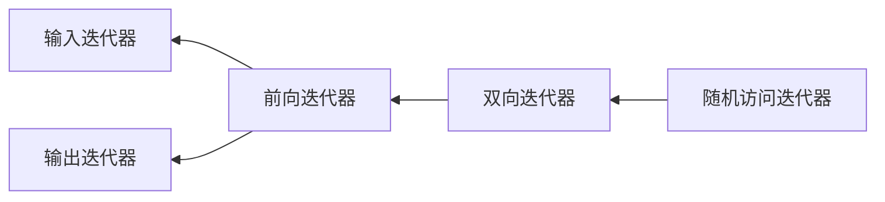

# template 模板

[toc]

## 函数模板

#### 类属性
- 一个程序实体能对多种类型的数据进行操作的特性称为类属性。
- 通常有类属函数和类属类

#### 实现类属函数
- 宏定义：本质是编译前的文字替换，因此不作为类属函数考虑
- 指针类型参数：实现麻烦，容易出错
- 函数模板
```cpp
template <class T1, class T2, ...>
<返回值类型> <函数名>(<参数表>){
    ...
}
```

#### 函数模板实例化
- 实际上，函数模板定义了一系列重载的函数
- 编译程序会根据调用时实参的类型自动将模板实例化为具体的函数，这个过程称为*模板实参推演*

## 类模板

#### 类模板使用
- 类定义
```cpp
template <class T1, class T2, ...>
class <类名>{
    <类成员声明>
};
```
- 类外成员函数定义
```cpp
template <class T1, class T2, ...>
<返回值类型> <类名><T1, T2, ...>::<函数名>(<参数表>){
    ...
}
```
- 类模板的使用需要在程序中显式指出
```cpp
vector <int> v;
```

## 模板的复用
- 函数模板的实例化可以是显式的，也可以是隐式的
- 类模板的实例化是显式的
- 一般来说将模板的定义和实现放在同一个头文件中，否则若放在源文件中，该源文件中未使用到模板的某个实例，就不会生成该实例的代码

## C++标准模板库STL

#### 容器模板
- `vector<T>`、`map<T>`、`queue<T>`、`set<T>`等

#### 算法模板
- 算数算法在头文件`numeric`定义，其他算法在头文件`algorithm`定义
- 有些算法要求提供一个称为*谓词*的函数或函数对象作为自定义的操作类型，参数为元素类型，返回值为`bool`，如`sort`函数的第三个参数
- 有些算法要求提供一个称为*操作*的函数或函数对象用于参与算法的操作，参数和返回值类型由算法决定
- 谓词和操作常使用匿名函数（$\lambda$表达式）

#### 迭代器模板
- 实现了抽象的智能指针功能，指向容器中的元素
- 输出迭代器：只能修改指向的容器元素
- 输入迭代器：只能读取指向的容器元素
- 前向迭代器：输出迭代器 + 输入迭代器
- 双向迭代器：前向迭代器 + 可进行`--`操作
- 随机访问迭代器：具有双向迭代器的所有功能，并能进行随机访问`[]`操作，以及`+`,`-`,`+=`,`-=`,`<`,`>`,`<=`,`>=`操作
```cpp
auto b = v.begin(), e = v.end(); // 定义迭代器

for (auto it = v.begin(); it != v.end(); ++it){
    ... // 迭代遍历容器v
}
```


## $\lambda$ 表达式

#### 语法
```cpp
[<捕获表>] (<参数表>) -> <返回值类型> {<函数体>}
// example
auto f() = [] () /* ->int */ { return 1; };
cout << f();
```
其中返回值类型可省略

#### 捕获表
- 表明函数要使用的外部变量，否则只能使用参数表里的变量
- 要改变捕获的变量的拷贝，使用`mutable`
- 捕获方式

|捕获语法|含义|
|:--:|:--:|
|`[]`|未捕获变量|
|`[a]`|`a`按值捕获|
|`[&a]`|`a`按引用捕获|
|`[=]`|用到的任何外部变量按值捕获|
|`[&]`|用到的任何外部变量按引用捕获|
|`[a, &b]`|`a`按值捕获，`b`按引用捕获|
|`[=, &a]`|`a`按引用捕获，其他所有用到的变量按值捕获|
|`[&, a]`|`a`按值捕获，其他所有用到的变量按引用捕获|