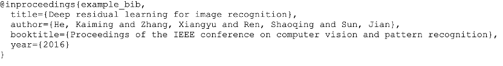

# NJU高级程序设计 homework

## 第一次作业
**1. 简述面向对象程序设计中类和对象的概念，并说明它们之间的关系。**
- 类是现实世界或思维世界中的实体在计算机中的反映，它将数据以及这些数据上的操作封装在一起。 
- 对象是具有类类型的变量。 
- 类是对象的抽象，而对象是类的具体实例。类是抽象的，不占用内存，而对象是具体的，占用存储空间。

**2. 与面向过程的程序设计相比，面向对象的程序设计有哪些优势？**
- 以数据为中心，强调数据抽象，操作依附于数据； 
- 实现了数据的封装，加强了数据的保护； 
- 模块边界清晰； 
- 对象往往具有通用性，使得程序容易复用；
- 对象相对稳定，有利于程序维护； 
- 基于对象/类的解题方式与问题空间有很好的对应。

**3. 在C++的类定义中，访问控制修饰符有哪些？简述不同访问控制修饰符对类成员的访问限制。**
- 访问控制修饰符有public，private和protected; 
- public：访问不受限制；
private：只能在本类和友元的代码中访问；
protected：只能在本类、派生类和友元的代码中访问。

**4. 定义一个文献信息类Literature, 具体要求如下**
1. 数据成员
a)   作者
b)   论文标题
c)   会议名
d)   年份
2. 成员函数
```C++
void setAuthor(string _author)//设置作者；
void setTitle(string _title)//设置论文标题;
void setBookTitle(string _book_title)//设置会议名；
void setYear(int _year)//设置论文年份;
void getBibTeX()//输出该文献对应的BibTeX，参考格式如下：
```

3. 数据成员的访问控制均为private；
4. 编写控制台程序实现以上需求，并提供运行结果截图

```c++
class Literature{
private:
    string author;
    string title;
    string booktit;
    int year;
public:
    void setAuthor(string _author){
    	author = _author; 
    }
    void setTitle(string _title){
    	title = _title;
    }
    void setBookTitle(string _book_title){
    	booktit = _book_title;
    }
    void setYear(int _year){
    	year = _year;			
    }
    void getBibTeX(){
    	assert(!author.empty()&&!title.empty()&&!booktitempty()&&year);
	    cout << "@inproceedings{example_bib,\n"
	    	 << "  title={" << title << "},\n"
	    	 << "  author={" << author << "},\n"
	    	 << "  booktitle={" << booktit << "},\n"
	    	 << "  year={" << year << "}\n}";
    }
};
```

## 第二次作业
**1. C++的成员对象是什么？当创建包含成员对象的类的对象时，构造函数和析构函数函数的调用顺序时什么样的？**
- 成员对象:当一个类的成员是另一个类的对象时，这个对象就叫成员对象。 
- 一个有成员对象的类实例化时要先调用成员对象的构造函数，然后再调用该类的构造函数;析构函数反之，先调用该类的析构函数，再调用成员对象的析构函数。

**2. 在什么情况下会调用拷贝构造函数？什么时候需要自定义拷贝构造函数？**
- 通过使用另一个同类型的对象来初始化新创建的对象时; 把对象作为值参数传给函数时; 把对象作为函数的返回值时; 
- 在对含有指针成员的对象进行拷贝时，必须要自己定义拷贝构造函数，进行深拷贝;如果不自己定义拷贝构造函数，会造成调用一次构造函数，调用两次析构函数的情况，即指针被分配一次内存，但是程序结束时该内存却被释放了两次，会导致程序崩溃。

**3. 定义一个用户信息类，具体要求如下**
```C++
class User{
private:
    char *name;
    int age;
};
```
请实现如下的功能：
默认构造函数：初始name为空字符串，最大32位字符空间，age为0；
构造函数：给定一个字符串和整形数，并分别初始化为name，age；
析构函数；
拷贝构造函数；

```c++
class User{
private:
    char *name;
    int age;
public:
    User();
    User(char *_name, int _age);
    ~User();
    User(const User &_user);
    void print(){
        cout << name << ' ' << age << endl;
    }
};

User::User(){
    name = new char[32];
    *name = '\0';
    age = 0;
}

User::User(char *_name, int _age){
    name = new char[32];
    if (strlen(_name)>32) {
        cout << "Name too long!" << endl;
        exit(0);
    }
    strcpy(name, _name);
    age = _age;
}

User::User(const User &_user){
    name = new char[32];
    strcpy(name, _user.name);
    age = _user.age;
}

User::~User(){
    delete []name;
    name = NULL;
}

```
**4. a) 雷电是一款经典的飞行射击游戏，玩家会操作一架飞机进行游戏。飞机可以使用一个类（Fighter）实现。其具备的基本属性至少包括：**
```c++
class Fighter{
private:
    char *name;
    int health;
    int attack;
    int ammo;
public：
    int shoot();
    void death();
};
```

默认用户名称（name）不超过32字符、默认血量（health）为100、默认攻击（attack）为2、默认弹药量（ammo）为999。其基本的攻击方法为射击（shoot），调用时的功能为返回当前飞机的攻击力;

在游戏初始的时候会产生一个具体的以玩家命名的飞机对象，并设置初始血量和攻击。若游戏中飞机死亡会调用death方法，效果为输出“dead”，且系统会销毁飞机对象，释放内存。请按如上要求设计实现对应的飞机Fighter类。

b) 此外游戏中存在代表武器升级的「弹药箱」类。弹药箱可以为当前的飞机替换成其他强化的攻击方式。

首先武器的基本属性应该包括：武器名（name），弹药数（ammo），弹药攻击力（attack）。为此，Fighter类中需要定义新的升级（upgrade）方法和新的数据成员以实现“升级武器”的功能。而升级后对象的shoot方法将返回弹药对应的攻击力并减少对应的弹药量。弹药量减为0时，这个武器成员会被销毁释放，而攻击方式还原为基本攻击的shoot攻击力属性和功能。

请设计一个至少满足如下“核弹类”方法的实现途径，并调整Fighter类的实现。
```c++
class Weapon{
private：
    char* name;
    int ammo;
    int attack;
};
```

默认名字（name）为”nuke”，其弹药数（ammo）为3，弹药攻击力（attack）为999.

升级核弹的飞机对象调用shoot方法除了原本Fighter对象中对应的功能，还会减少对应弹药量并输出“kill them all!”。

请设计合适的方法实现，并提交相关代码文件和运行截图(调用一次shoot，之后升级一次核弹武器，连续调用4次shoot)。

PS. 在实际项目中，由于武器可以叠加并存而非替换（例如副武器系统，这意味着大量武器类可以以组合的形式共存并叠加功能），若项目实现不能设计指数级别扩增飞机类，在项目中还能如何实现相关功能？（关键字：类继承、装饰器模式）

```c++
class Weapon{
private:
    char* name;
    int ammo;
    int attack;
public:
    Weapon();
    ~Weapon();
    char* retname();
    int retammo();
    int retattack();
};

class Fighter{
private:
    char *name;
    int health;
    int attack;
    int ammo;
    int weapon;
public:
    Fighter();
    Fighter(char* _name);
    ~Fighter();
    int shoot();
    void death();
    void upgrade(Weapon *w);
};

Fighter::Fighter(){
    name = new char[32];
    *name = '\0';
    health = 100;
    attack = 2;
    ammo = 999;
    weapon = 0;
}

Fighter::~Fighter(){
    delete []name;
    name = NULL;
}

int Fighter::shoot(){
    if (weapon==0)
        return attack;
    else {
        if (ammo==0) {
            attack = 2;
            ammo = 999;
            weapon = 0;
        }
        else {
            ammo--;
            if (weapon==1) cout << "kill them all\n";
        }
        return attack;
    }
}

void Fighter::upgrade(Weapon *w){
    attack = w->retattack();
    ammo = w->retammo();
    char weaponname[] = "nuke";
    if (strcmp(w->retname(), weaponname)==0)
        weapon = 1;
}

void Fighter::death(){
    cout << "dead\n";
}

Fighter::Fighter(char* _name){
    name = new char[32];
    strcpy(name, _name);
    health = 100;
    attack = 2;
    ammo = 999;
    weapon = 0;
}

Weapon::Weapon(){
    name = new char[32];
    name[0] = 'n'; name[1] = 'u'; name[2] = 'k'; name[3] = 'e'; name[4] = '\0';
    attack = 999;
    ammo = 3;
}

Weapon::~Weapon(){
    delete []name;
    name = NULL;
}

char* Weapon::retname(){
    return name;
}

int Weapon::retammo(){
    return ammo;
}

int Weapon::retattack(){
    return attack;
}
```

## 第三次作业
**4. 定义一个文献信息类Literature, 具体要求如下**
**4. 定义一个文献信息类Literature, 具体要求如下**
**4. 定义一个文献信息类Literature, 具体要求如下**
**4. 定义一个文献信息类Literature, 具体要求如下**


## 第四次作业


## 第五次作业


## 第六次作业


## 第气次作业

## 第八次作业


## 第九次作业

## 第十次作业

## 第十一次作业

## 第十二次作业